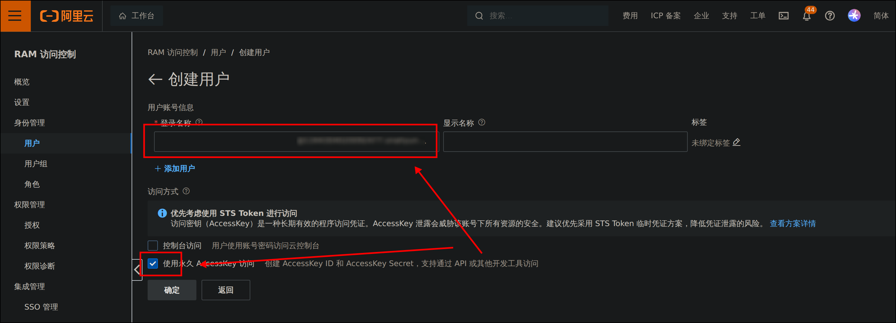

本文介绍如何使用 `Certbot` 向 `Let's encrypt` 申请证书，使用阿里云服务器。

## 证书是什么？

> 已经了解证书和通配符证书，可以直接到[实践](#如何申请证书？)步骤

> 公开密钥认证（英语：Public key certificate），又称数字证书（digital certificate）或身份证书（identity certificate）。是用于公开密钥基础建设的电子文件，用来证明公开密钥拥有者的身份。此文件包含了公钥信息、拥有者身份信息（主体）、以及数字证书认证机构（发行者）对这份文件的数字签名，以保证这个文件的整体内容正确无误。拥有者凭着此文件，可向电脑系统或其他用户表明身份，从而对方获得信任并授权访问或使用某些敏感的电脑服务。  
> —— [wikipedia](https://zh.wikipedia.org/wiki/%E5%85%AC%E9%96%8B%E9%87%91%E9%91%B0%E8%AA%8D%E8%AD%89)

简而言之，证书就是服务提供者向用户证明身份的电子签名。一个比较常见的应用场景就是我们后面提到的网站建设。当一个用户需要访问一个网站时，与网站安全的通信，保证信息不被他人知晓、篡改，就要使用证书来帮助我们。具体而言，在一次对话开始时，我们通过证书验明来着身份，然后就开始互相交换密钥，后面的所有消息都通过密钥加密，而其他人不知道这个密钥，也就无法知晓我们之间对话的内容。

那这就出现了一个问题，假设你想要访问一个网站 A, 有个人拿着 A 的证书说我就是你要找的人，你如何确定这是真的呢？这就需要使用一个信任体系，一般来说，是权威的机构，为网站 A 颁发了一份证书，这份证书上有该机构的签名，也就是证明了这份证书的有效性，然后网站 A 收到你的请求，会用这个证书签名一份公钥，将这个证书的可以公开的部分和公钥一同发给你，而你是信任机构的，具体而言，你持有机构的一份公钥，你可以使用这个公钥去检验证书的有效性，证书有效，而其他人由于没有证书不可公开的部分，没法伪造出来，所以你就可以信任证书，之后你就可以验证网站给你的公钥是有效的，因为公钥也被签名了，后续通过公钥再生成一系列密钥，你们就可以安全的通信了。

而 `http` 协议和 `https` 协议的区别就在于我们使用了 `TLS` 证书，可以进行安全通信。

以上简要一提证书的概念，而证书的体系一般是这样的:

- 根证书： 最权威的机构拥有的证书，他可以给其他机构的证书签名
- 终端实体证书：一般就是我们网站所拥有的证书了

详细的概念可以查询上面提到的 wikipedia 或看看这篇[文章](https://www.internetsociety.org/deploy360/tls/basics/)

## 统配符证书 (Wildcard SSL Certificates)

通配符证书就是在域名字段中包含 `*` 的单个证书，这种证书的好处是只需要签发一次证书就能为子服务提供证书服务，具体来说，假设我们有博客服务、翻译服务、网盘服务，并通过下面的方式来组织：

- `blog.chrjeb.cn` 博客服务
- `fanyi.chrjeb.cn` 翻译服务
- `driver.chrjeb.cn` 网盘服务

可以看到上面的每个服务都有不同的域名，因此，如果不使用通配符证书，我们就需要为上面的每一个服务都签发一份证书，而如果使用通配符证书，证明了我们拥有 `chrjeb.cn` 这个域名，我们就可以直接为上面的三个服务升级 HTTPS 服务了。

> 🛈 Tips  
> 证书认证的就是域名的所有权，所以我们可以把证书放到不同的服务器，IP 地址的变化不会影响到证书的使用上。

> 阿里云免费提供具体到子域名的证书，不想麻烦申请通配符证书的可以直接使用这种方法，我们也可以通过 Nginx 实现[一个域名对应多个服务](#不想申请通配符证书)
>

## 如何申请证书？

我们可以使用 Let's Encrypt 免费申请有效期为半年的免费证书，并通过设置自动任务来续期。需要使用到 `Certbot` 工具和 `Aliyun` 的 CLI 工具。


### 安装 Certbot

我们需要首先安装 `Certbot`，我使用的环境如下：

- Nginx 反向代理
- Python venv 和 pip （下文提到如何安装）
- Ubuntu & APT 包管理器

若使用其他环境，或者不确定自己的环境，可以参照 `Certbot` 的[官方文档](https://certbot.eff.org/instructions)，注意选择 Wildcard (通配符证书) 的选项。

:::important
在过程中遇到任何问题，都可以查看 `Certbot` 的 [Userguide](https://eff-certbot.readthedocs.io/en/latest/using.html#user-guide)
:::

> ⚠️  
> 下面的操作都是在服务器上进行，请使用 `ssh` 或其他你喜欢的方式连接你的服务器。

首先使用 `apt` 安装需要的软件包：

```bash
sudo apt update    # 更新可用软件包列表
sudo apt install python3 python3-dev python3-venv libaugeas-dev gcc    # 安装 Python 环境(venv & pip)和一些 Certbot 的依赖

# 旧版本的 apt 请加上 -get：
sudo apt-get update
sudo apt-get install python3 python3-dev python3-venv libaugeas-dev gcc
```

> 如果没有任何 Error，那么你可以进行下一步了，否则，可以问问大模型，查阅资料，特别是看看官方文档有没有提到什么有用的信息。遇到任何问题，也欢迎在评论区提出。

接着，我们移除可能安装过的 Certbot 软件包，这一步大部分人都没有问题，应该都没有安装过：

```bash
sudo apt remove certbot

# 同样，旧版本加上 -get, 后文将不再指出
sudo apt-get remove certbot
```

接下来，配置 `Python` 虚拟环境：

```bash
sudo python3 -m venv /opt/certbot/    # 配置虚拟环境
sudo /opt/certbot/bin/pip install --upgrade pip    # 更新 pip
```

> ⚠️  
> 不要忘了 `sudo`，可能会因为安装范围的问题出现难以发现的错误。
> 遇到问题，请再次核对以上命令，没有问题就可以继续了。

安装 Certbot 以及 `certbot-nginx` （用于帮助我们在后续自动配置 Nginx）：

```bash
sudo /opt/certbot/bin/pip install certbot certbot-nginx
```

现在将安装好的 certbot 设置为系统范围的程序：

```bash
sudo ln -s /opt/certbot/bin/certbot /usr/bin/certbot
```

若上面的步骤正确执行，你应该可以使用下面的命令：

```bash
$ certbot --version
certbot 5.1.0
```

### 安装 Aliyun 插件

接下来安装 `Aliyun` 相关的工具，若你使用其他 DNS 解析服务商，请参考 `Certbot` 的[文档](https://certbot.eff.org/instructions)。

我使用了这个[插件](https://github.com/justjavac/certbot-dns-aliyun)进行配置，截至目前（2025 年 10 月 31 日），该工具可以正常使用。

我们首先安装 Aliyun 官方提供的 CLI 工具：

```bash
$ wget https://aliyuncli.alicdn.com/aliyun-cli-linux-latest-amd64.tgz && tar xzvf aliyun-cli-linux-latest-amd64.tgz && sudo cp aliyun /usr/local/bin && rm aliyun

--2025-10-31 20:48:36--  https://aliyuncli.alicdn.com/aliyun-cli-linux-latest-amd64.tgz
Resolving aliyuncli.alicdn.com (aliyuncli.alicdn.com)... 47.105.29.122, 47.105.29.123
Connecting to aliyuncli.alicdn.com (aliyuncli.alicdn.com)|47.105.29.122|:443... connected.
HTTP request sent, awaiting response... 200 OK
Length: 16851756 (16M) [application/x-compressed-tar]
Saving to: ‘aliyun-cli-linux-latest-amd64.tgz’

aliyun-cli-linux-latest-a 100%[=====================================>]  16.07M  --.-KB/s    in 0.05s   

2025-10-31 20:48:36 (321 MB/s) - ‘aliyun-cli-linux-latest-amd64.tgz’ saved [16851756/16851756]

aliyun
```

现在可以给 Aliyun [配置凭证](https://help.aliyun.com/zh/cli/configure-credentials)。

> ⚠️  
> 下文我会同时给出操作和阿里云提供的帮助文档，请对照执行。
> **需要注意的是 Aliyun 建议使用普通用户进行凭证配置，但由于 certbot 在超级用户下执行，所以运行 CLI 时需要加上 `sudo`。**

1. 前往创建 RAM 用户的 [AccessKey](https://help.aliyun.com/zh/ram/user-guide/create-an-accesskey-pair?spm=a2c4g.11186623.0.0.212c332aH1pQJo#title-ebf-nrl-l0i)，若已经拥有并记得 id 和 key，可以跳过。
    我们需要前往[创建用户](https://ram.console.aliyun.com/users)，点击创建用户，注意需要允许 Access Key 访问。
    
    创建完毕后，点击该用户，去认证管理下创建 AccessKey。**创建完毕后一定记住保存好 id 和 key。**
    
    

2. 回到服务器使用下面的命令，进行配置:
    ```bash
    $ sudo aliyun configure --profile Akprofile
    [sudo] password for alice: 
    Configuring profile 'Akprofile' in 'AK' authenticate mode...
    Access Key Id []: <Your-AccessId>
    Access Key Secret []: <Your-AccessKey>
    Default Region Id []: <Your-RegionId>
    Default Output Format [json]: json (Only support json)
    Default Language [zh|en] en: 
    Saving profile[Akprofile] ...Done.
    
    Configure Done!!!
    ..............888888888888888888888 ........=8888888888888888888D=..............
    ...........88888888888888888888888 ..........D8888888888888888888888I...........
    .........,8888888888888ZI: ...........................=Z88D8888888888D..........
    .........+88888888 ..........................................88888888D..........
    .........+88888888 .......Welcome to use Alibaba Cloud.......O8888888D..........
    .........+88888888 ............. ************* ..............O8888888D..........
    .........+88888888 .... Command Line Interface(Reloaded) ....O8888888D..........
    .........+88888888...........................................88888888D..........
    ..........D888888888888DO+. ..........................?ND888888888888D..........
    ...........O8888888888888888888888...........D8888888888888888888888=...........
    ............ .:D8888888888888888888.........78888888888888888888O ..............
    ```
    > ⚠️  
    > 上面使用 `<Place-Holder>` 占位符的地方请自行替换成你自己的信息，其中的 `RegioinId` 请自行查阅该[列表](https://help.aliyun.com/zh/drp/support/region-ids)，根据服务器所处位置填入其中。

接下来安装插件：

```bash
wget https://cdn.jsdelivr.net/gh/justjavac/certbot-dns-aliyun@main/alidns.sh && sudo cp alidns.sh /usr/local/bin && sudo chmod +x /usr/local/bin/alidns.sh && sudo ln -s /usr/local/bin/alidns.sh /usr/local/bin/alidns && rm alidns.sh
```

> ⚠️
> 你可能会遇到网络问题，请参照下面的方法，否则请跳过下面的部分

<details>
  <summary><b>手动下载脚本并上传到服务器</b> (click to show)</summary>

将这个 url 粘贴到服务器，会自动下载一个脚本（**若没有下载成功，请科学上网**）：

```url
https://cdn.jsdelivr.net/gh/justjavac/certbot-dns-aliyun@main/alidns.sh
```

下载完毕后，我们这里使用 `sftp`，你也可以使用其他工具，一般来说，安装有 `ssh` 的客户端都有 `sftp`.**在你的本地物理机上，使用下面的命令连接你的服务器：**

```bash
# 在此之前，请先到刚才下载的 `alidns.sh` 所在目录
sftp 用户名@IP地址

# 如果服务器 ssh 端口不在 22 端口（一般来说都是 22 端口），请使用
sftp -P 服务器端口 用户名@IP地址
```

接着，使用下面的命令传输本地文件到服务器上：
```bash
sftp> put alidns.sh
Uploading alidns.sh to /home/jebhim/alidns.sh
alidns.sh         100% 1145    37.7KB/s   00:00
sftp> exit
```

**回到服务器上**，使用下面的命令到刚才上传到的目录：

```bash
cd /home/用户名
```

然后执行下面的命令：

```bash
sudo cp alidns.sh /usr/local/bin && sudo chmod +x /usr/local/bin/alidns.sh && sudo ln -s /usr/local/bin/alidns.sh /usr/local/bin/alidns && rm alidns.sh
```

好了，网络异常的解决方法到此结束。

</details>

### 申请证书

终于可以申请证书了，我们先测试一下，**注意修改下面命令的占位符**：

```bash
sudo certbot certonly -d *.<Your-Domain> -d <Your-Domain> --manual --preferred-challenges dns --manual-auth-hook "alidns" --manual-cleanup-hook "alidns clean" --dry-run
```
> `Your-Domain` 举例：`chrjeb.cn`

如果出现下面的错误，多半是网络问题，要么主动尝试让网络情况变好（具体自行进行），要么等待网络情况变好...

```bash
An unexpected error occurred:
requests.exceptions.ReadTimeout: HTTPSConnectionPool(host='acme-staging-v02.api.letsencrypt.org', port=443): Read timed out. (read timeout=45)
```

> ⚠️  
> 另一种可能行得通的解决方法是删除一个证书匹配的域名，将上面的命令中的 `-d <Your-Domain>` 删去而保留 `-d *.<Your-Domain>`。
> 需要注意的是，这会产生一个问题，以后访问 `https://chrjeb.cn` 的服务会显示不安全，而访问 `https://blog.chrjeb.cn` 等有子域名的服务则是安全的。

出现类似下面的输出，这个地方的结果是删去了一个域名的输出，则是成功的：

<blockquote>
<details><summary><b>🎉🎉🎉 你可能同样无法成功。但是！还有办法！</b> (click to show)</summary>
除了这种自动化让 let's encrypt 颁发证书的方式，还有一种手动的方式，你可以参阅这个 Certbot <a href="https://eff-certbot.readthedocs.io/en/latest/using.html#manual">文档</a>，他介绍了两种方式：<br>
<b>半自动的 http 挑战</b>和<b>另一种更加可靠的（对于网络不好的服务器）dns 挑战</b>。<br>
两种挑战同样使用 `certbot` 命令运行。dns 挑战需要在你的 DNS 提供商设置一个特殊的文本解析记录，然后就能够获得证书，其缺点也很明显，没办法自动获取证书。 获取完证书，你可以直接进行<a href="#安装证书（为-Nginx）">这一步</a>。
</details>
</blockquote>

```bash
$ sudo certbot certonly -d *.chrjeb.cn --manual --preferred-challenges dns --manual-auth-hook "alidns" --manual-cleanup-hook "alidns clean" --dry-run
Saving debug log to /var/log/letsencrypt/letsencrypt.log
Simulating a certificate request for *.chrjeb.cn
Hook '--manual-auth-hook' for chrjeb.cn ran with output:
 {
 	"RecordId": "XXXXXXXXXXXXXXXXX",
 	"RequestId": "XXXXXXXX-XXXX-XXXX-XXXX-XXXXXXXXXXXX"
 }
Hook '--manual-cleanup-hook' for chrjeb.cn ran with output:
 {
 	"RecordId": "XXXXXXXXXXXXXXXXX",
 	"RequestId": "XXXXXXXX-XXXX-XXXX-XXXX-XXXXXXXXXXXX"
 }
The dry run was successful.
```

如果没有问题，去掉结尾的 `--dry-run`，并加上 `-i nginx`，我们可以正式申请证书了，否则，请检查前面的所有步骤。  
邮箱不想输入可以直接回车跳过，**注意，这个命令会同时将证书安装到 Nginx**。

```bash
$ sudo certbot certonly -d *.chrjeb.cn --manual --preferred-challenges dns --manual-auth-hook "alidns" --manual-cleanup-hook "alidns clean" -i nginx
Saving debug log to /var/log/letsencrypt/letsencrypt.log
Enter email address or hit Enter to skip.
 (Enter 'c' to cancel):                     

- - - - - - - - - - - - - - - - - - - - - - - - - - - - - - - - - - - - - - - -
Please read the Terms of Service at:
https://letsencrypt.org/documents/LE-SA-v1.5-February-24-2025.pdf
You must agree in order to register with the ACME server. Do you agree?
- - - - - - - - - - - - - - - - - - - - - - - - - - - - - - - - - - - - - - - -
(Y)es/(N)o: Yes
Account registered.
Requesting a certificate for *.chrjeb.cn
Hook '--manual-auth-hook' for chrjeb.cn ran with output:
 {
 	"RecordId": "XXXXXXXXXXXXXXXXX",
 	"RequestId": "XXXXXXXX-XXXX-XXXX-XXXX-XXXXXXXXXXXX"
 }
Hook '--manual-cleanup-hook' for chrjeb.cn ran with output:
 {
 	"RecordId": "XXXXXXXXXXXXXXXXX",
 	"RequestId": "XXXXXXXX-XXXX-XXXX-XXXX-XXXXXXXXXXXX"
 }

Successfully received certificate.
Certificate is saved at: /etc/letsencrypt/live/chrjeb.cn/fullchain.pem
Key is saved at:         /etc/letsencrypt/live/chrjeb.cn/privkey.pem
This certificate expires on 2026-01-29.
These files will be updated when the certificate renews.

NEXT STEPS:
- The certificate will need to be renewed before it expires. Certbot can automatically renew the certificate in the background, but you may need to take steps to enable that functionality. See https://certbot.org/renewal-setup for instructions.

- - - - - - - - - - - - - - - - - - - - - - - - - - - - - - - - - - - - - - - -
If you like Certbot, please consider supporting our work by:
 * Donating to ISRG / Let's Encrypt:   https://letsencrypt.org/donate
 * Donating to EFF:                    https://eff.org/donate-le
- - - - - - - - - - - - - - - - - - - - - - - - - - - - - - - - - - - - - - - -
```

这是上述所有 Let's encrypt 获取证书的方法的[原理](https://letsencrypt.org/zh-cn/docs/challenge-types/)。

### 安装证书（为 Nginx）

使用正常的自动获取证书的方法已经安装证书了，对于手动获取证书的，使用下面的命令将证书自动安装到 `Nginx` 的默认服务：

```bash
$ sudo certbot install --nginx --cert-name chrjeb.cn -d <Domain-01> -d <Domain-02> [...]
Saving debug log to /var/log/letsencrypt/letsencrypt.log
Deploying certificate
Successfully deployed certificate for chrjeb.cn to /etc/nginx/sites-enabled/jblog
Successfully deployed certificate for chrjeb.cn to /etc/nginx/sites-enabled/jblog
...
```
> 你可以指定多个域名/子域名，命令中的 `[...]` 表示若干个你想指定的域名，比如：
> `-d www.chrjeb.cn -d blog.chrjeb.cn -d fanyi.chrjeb.cn -d chrjeb.cn`

上面的命令会自动将证书安装到 Nginx 中，即对 Nginx 进行配置，你可以使用 `sudo certbot --nginx rollback` 来撤销刚才的操作

然后你可以去配置里面查看：


### 设置自动更新

目前我们获得的证书半年就会过期，因此，我们可以设置一个自动脚本来定期更新（这要求你前面可以使用自动获取证书的方法）：

```bash
$ sudo crontab -e
```

然后添加到文件末尾：

```bash
1 1 */1 * * root certbot renew --manual --preferred-challenges dns --manual-auth-hook "alidns" --manual-cleanup-hook "alidns clean" --deploy-hook "nginx -s reload"
```

## 不想申请通配符证书

你可以直接在 `Certbot` [教程](https://certbot.eff.org/instructions?ws=nginx&os=pip&tab=default) 点击 default 选项继续，或者直接去云厂商申请免费证书。

----

Read more:  
[为什么不使用阿里云/腾讯云等公有云厂商提供的免费证书](https://zhuanlan.zhihu.com/p/704965374)
